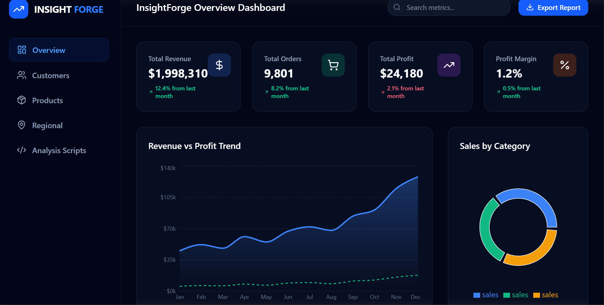
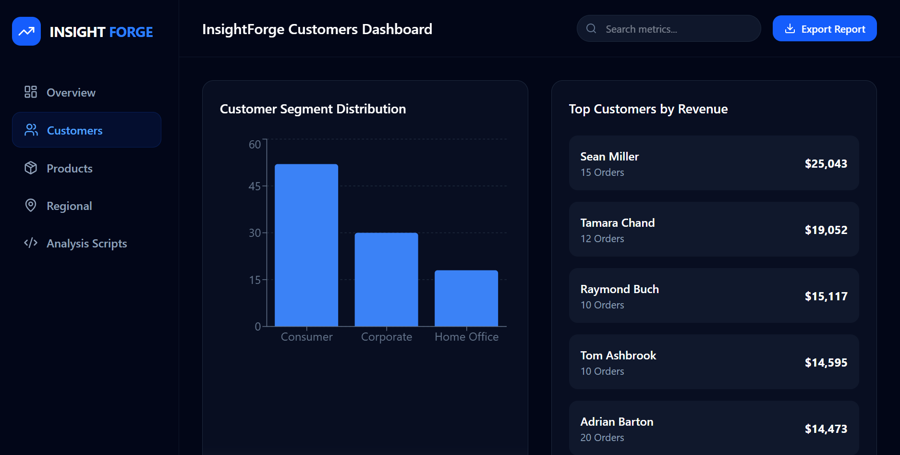
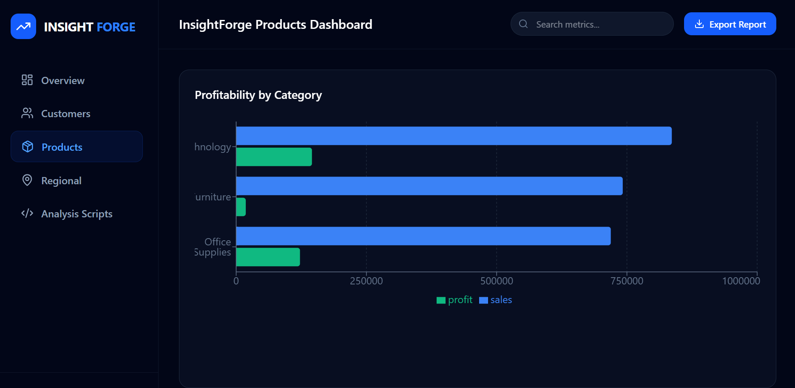
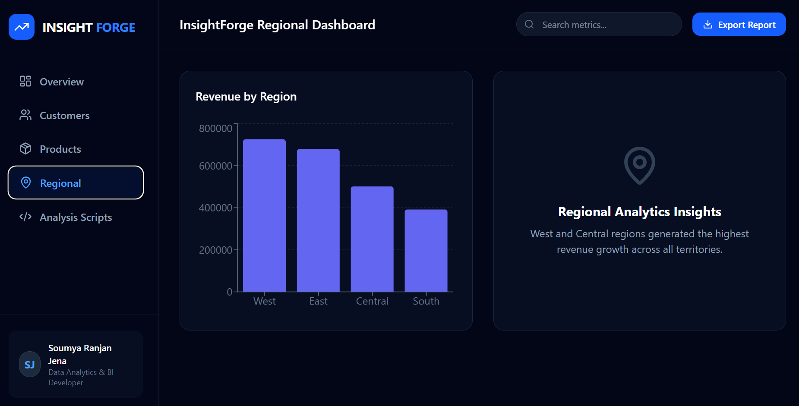

# 🚀 InsightForge E-Commerce Analytics Dashboard

A modern and interactive E-Commerce Analytics Dashboard built using React, TypeScript, and real-world sales datasets to visualize business performance, customer insights, product analytics, and regional trends.

---

# 📌 Project Overview

This project helps businesses analyze:

- Sales Performance
- Customer Insights
- Product Profitability
- Regional Growth
- Revenue Trends
- Profit Margins

The dashboard transforms raw CSV sales data into meaningful business insights through modern visualizations and KPI tracking.

---

# ✨ Features

## 📊 Overview Dashboard
- Total Revenue Tracking
- Total Orders Monitoring
- Profit Margin Analysis
- Revenue Growth Insights

## 👥 Customer Analytics
- Top Customers
- Customer Purchase Behavior
- Customer Segmentation

## 📦 Product Analytics
- Best Selling Products
- Product Category Analysis
- Profitability Tracking

## 🌍 Regional Insights
- Region-wise Sales Distribution
- Shipping & Delivery Trends
- Geographic Performance Tracking

## 📈 Interactive Charts
- Revenue vs Profit Trends
- Sales by Category
- Monthly Performance Analysis

---

# 🛠️ Technologies Used

- React.js
- TypeScript
- Vite
- Tailwind CSS
- Recharts
- CSV Dataset Integration
- Git & GitHub

---

# 📂 Dataset Used

- Superstore Sales Dataset
- Real-world E-Commerce Sales Data
- CSV-based analytics processing

---

# 🎯 Key Skills Demonstrated

- Frontend Development
- Dashboard Design
- Data Visualization
- Business Analytics
- KPI Monitoring
- Data Handling using CSV
- GitHub Project Management

---

# 📸 Dashboard Preview

## 🔹 Overview Dashboard
 

## 🔹 Customers Dashboard
 

## 🔹 Products Dashboard
 

## 🔹 Regional Dashboard
 

---

# ⚡ Installation

```bash
npm install
npm run dev
